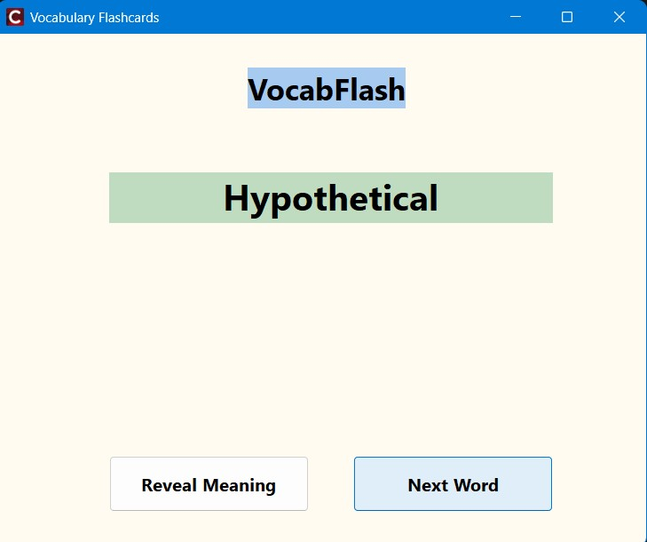
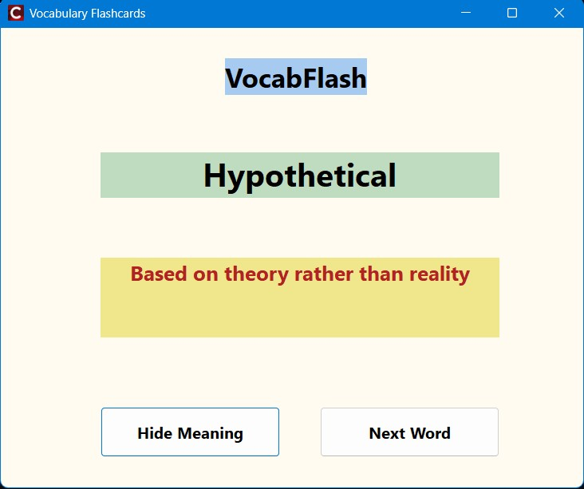

# Vocabulary Flashcard App 📚

A simple and effective vocabulary learning tool built with C++ Builder. Perfect for students and language learners who want to practice vocabulary through interactive flashcards.


## Features ✨

- 🎲 **Random Word Selection** - Shows words in random order for better learning
- 👁️ **Reveal/Hide Mechanism** - Test yourself before checking the answer
- 📝 **Simple Text File Format** - Easy to add and manage your vocabulary
- 🔄 **Quick Navigation** - Move to next word with a single click

## Screenshots 📸

### Main Interface


### Word Revealed


## Getting Started 🚀

### For Users (Quick Start)

1. Download the latest release from the [release](https://github.com/yourusername/vocab-flashcard-app/release) folder
2. Extract the `Release` folder to your desired location
3. Create a `vocab.txt` file in the same folder as the `.exe` (see usage section below)
4. Double-click the `.exe` file to run the app
5. Start learning!

**No installation required!** Just download and run.

<!--
### For Developers

#### Prerequisites
- C++ Builder (Embarcadero RAD Studio)
- Windows OS

#### Building from Source

1. Clone this repository:
```bash
git clone https://github.com/ishtiakahmedayon/VocabFlashApp.git
```

2. Open the project in C++ Builder:
   - Open `VocabFlash App.cbproj`

3. Build the project:
   - Press `F9` or go to `Project` → `Build`

4. The executable will be in the `Release` folder
-->
## Usage 📖

### Creating Your Vocabulary File

1. Create a file named `vocab.txt` in the same directory as the executable
2. Add your vocabulary in the following format:

```
word,meaning 

apple,a fruit that is red or green
book,a set of printed pages bound together
ephemeral,lasting for a very short time
ubiquitous,present everywhere
serendipity,finding something good without looking for it
algorithm,a step-by-step procedure for solving a problem
```

### File Format Rules

- Each word entry: `word,meaning`
- Empty lines are ignored
- No limit on number of words

### Running the App

1. Launch the application
2. Click **"Reveal Meaning"** to see the definition
3. Click **"Next"** to move to another random word
4. Repeat and learn!

## File Structure 📁

```
vocab-flashcard-app/debug/
│
├── Unit5.cpp           # Main form implementation
├── Unit5.h             # Header file with declarations
├── Unit5.dfm           # Form design file
├── vocab.txt           # Your vocabulary file (create this)
├── other files         # Necessary for app to run  
└── README.md
```

## How It Works 🔧

The application:
1. Loads all vocabulary from `vocab.txt` at startup
2. Stores words in a vector for quick access
3. Uses random selection to pick words
4. Toggles visibility of meanings on button click

## Customization 🎨

### Change File Location

Edit `Unit5.cpp`, line in `LoadVocabularyFiles()`:

```cpp
std::string filePath = ".\\vocab.txt";  // Change this path
```

### Add More UI Elements

Open `Unit5.dfm` in the Form Designer and customize:
- Fonts and colors
- Button styles
- Layout and positioning
<!--
## Contributing 🤝

Contributions are welcome! Feel free to:

1. Fork the project
2. Create a feature branch (`git checkout -b feature/AmazingFeature`)
3. Commit your changes (`git commit -m 'Add some AmazingFeature'`)
4. Push to the branch (`git push origin feature/AmazingFeature`)
5. Open a Pull Request
-->>
## Future Enhancements 💡

- [ ] Progress tracking
- [ ] Multiple vocabulary file support
- [ ] Search functionality
- [ ] Categories/tags for words
- [ ] Export/import from other formats (CSV, JSON)
- [ ] Quiz mode

Author ✍️
```
Submitted by:
Ishtiak Ahmed Ayon 
Course Code: ICT 1200
Course Name: Project-I

Supervised by:
Dr. Ziaur Rahman 
Associate Professor
Department of ICT, MBSTU
```
<!--


-->
